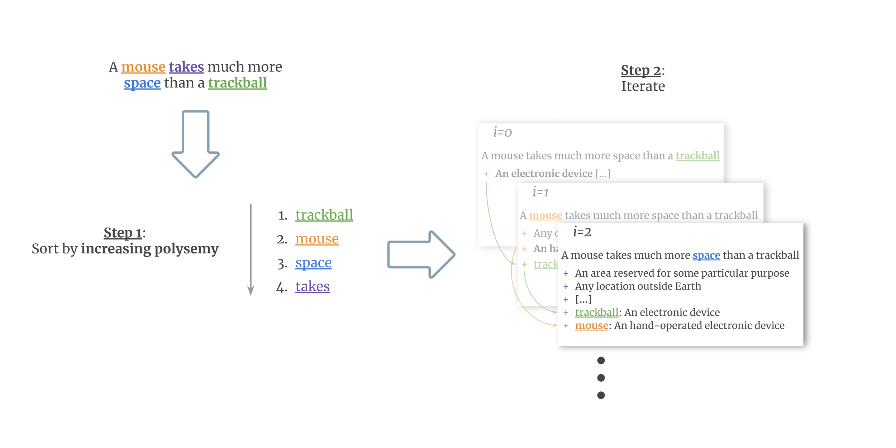

# ConSeC

[ConSeC](https://aclanthology.org/2021.emnlp-main.112/) is a novel approach to Word Sense Disambiguation (WSD), accepted at EMNLP 2021. It frames WSD as a text extraction task and features a feedback loop strategy that allows the disambiguation of a target word to be conditioned not only on its context but also on the explicit senses assigned to nearby words.



If you find our paper, code or framework useful, please reference this work in your paper:

```
@inproceedings{barba-etal-2021-consec,
    title = "{C}on{S}e{C}: Word Sense Disambiguation as Continuous Sense Comprehension",
    author = "Barba, Edoardo  and
      Procopio, Luigi  and
      Navigli, Roberto",
    booktitle = "Proceedings of the 2021 Conference on Empirical Methods in Natural Language Processing",
    month = nov,
    year = "2021",
    address = "Online and Punta Cana, Dominican Republic",
    publisher = "Association for Computational Linguistics",
    url = "https://aclanthology.org/2021.emnlp-main.112",
    pages = "1492--1503",
}
```

## Setup Env

Requirements:
* Debian-based (e.g. Debian, Ubuntu, ...) system 
* [conda](https://docs.conda.io/en/latest/) installed

Run the following command to quickly setup the env needed to run our code:
```bash
bash setup.sh
```

It's a bash command that will setup a conda environment with everything you need. Just answer the prompts as you proceed.

Finally, download the following resources:
* [Wikipedia Freqs](https://drive.google.com/file/d/1WqNKZZFXM1xrVlDUOFSwMBINJGFlbM_l/view?usp=sharing). This is a compressed
  folder containing the files needed to compute the PMI score. Once downloaded, place the file inside *data/* and run:
  ```bash
  cd data/
  tar -xvf pmi.tar.gz
  rm pmi.tar.gz
  cd ..
  ```
* optionally, you can download the following checkpoints and place them inside the *experiments/* folder (we recommend *experiments/released-ckpts/*):
  * [ConSeC-SemCor](https://drive.google.com/file/d/15__onFMnfGKKyulFxQLStUxdNKiqq-Rn/view?usp=sharing), that is, ConSeC trained on SemCor only (82.0 on ALL);
  * [ConSeC-SemCor+WNGT](https://drive.google.com/file/d/1dwzQ7QDwe8hH4pGBBe-5g4N_BI2eLDfA/view?usp=sharing), that is, ConSeC trained on SemCor + WNGT (83.2 on ALL);

## Train

This is a [PyTorch Lightning](https://www.pytorchlightning.ai/) project with [hydra](https://hydra.cc/) configurations files,
so most of the training parameters (e.g. datasets, optimizer, model, ...) are specified in yaml files. If you are
not familiar with hydra and want to play a bit with training new models, we recommend going first through
[hydra tutorials](https://hydra.cc/docs/tutorials/intro); otherwise, you can skip this section (but you should still checkout
hydra as it's an amazing piece of software!).

Anyway, training is done via the training script, *src/scripts/model/train.py*, and its parameters are read from the *.yaml* files in the *conf/* 
folders (but for the *conf/test/* folder which is used for evaluation). Once you applied all your desired changes, you can
run the new training with:
```bash
(consec) user@user-pc:~/consec$ PYTHONPATH=$(pwd) python src/scripts/model/train.py
```

## Evaluate

Evaluation is similarly handled via hydra configuration files, located in the *conf/test/* folder. There's a single file
there, which specifies how to evaluate (e.g. model checkpoint and test to use) against the framework of 
[Raganato et al. (2017)](https://www.aclweb.org/anthology/E17-1010.pdf) (we will include [XL-WSD](https://sapienzanlp.github.io/xl-wsd/), along with its checkpoints, later on). 
Parameters are quite self-explanatory and you might be most interested in the following ones:
* *model.model_checkpoint*: path to the target checkpoint to use
* *test_raganato_path*: path to the test file to evaluate against

To make a practical example, to evaluate the checkpoint we released against SemEval-2007, run the following command:
```bash
(consec) user@user-pc:~/consec$ PYTHONPATH=$(pwd) python src/scripts/model/raganato_evaluate.py model.model_checkpoint=experiments/released-ckpts/consec_semcor_normal_best.ckpt test_raganato_path=data/WSD_Evaluation_Framework/Evaluation_Datasets/semeval2007/semeval2007
```

**NOTE**: *test_raganato_path* expects what we refer to as a **raganato path**, that is, a prefix path such that both 
*{test_raganato_path}.data.xml* and *{test_raganato_path}.gold.key.txt* exist (and have the same role as in the standard
evaluation framework).

## Interactive Predict

We also implemented an interactive predict that allows you to query the model *interactively*; given as input:
* a word in a context
* its candidate definitions
* its context definitions
the model will disambiguate the target word. Check it out with:
```bash
(consec) user@user-pc:~/consec$ PYTHONPATH=$(pwd) python src/scripts/model/predict.py experiments/released-ckpts/consec_semcor_normal_best.ckpt -t
Enter space-separated text: I have a beautiful dog
Target position: 4
Enter candidate lemma-def pairs. " --- " separated. Enter to stop
 * dog --- a member of the genus Canis
 * dog --- someone who is morally reprehensible
 * 
Enter context lemma-def-position tuples. " --- " separated. Position should be token position in space-separated input. Enter to stop
 * beautiful --- delighting the senses or exciting intellectual or emotional admiration --- 3
 * 
        # predictions
                 * 0.9939        dog     a member of the genus Canis 
                 * 0.0061        dog     someone who is morally reprehensible 
```
The scores assigned to each prediction are their probabilities.


# Acknowledgments

The authors gratefully acknowledge the support of the ERC Consolidator Grant MOUSSE No. 726487 under the European Union’s Horizon 2020 research and innovation programme.

This work was supported in part by the MIUR under grant “Dipartimenti di eccellenza 2018-2022” of the Department of Computer Science of the Sapienza University of Rome.

# License

This work is under the [Attribution-NonCommercial-ShareAlike 4.0 International (CC BY-NC-SA 4.0) license](https://creativecommons.org/licenses/by-nc-sa/4.0/)
